# myx-im Architecture & Schema

## ER Diagram

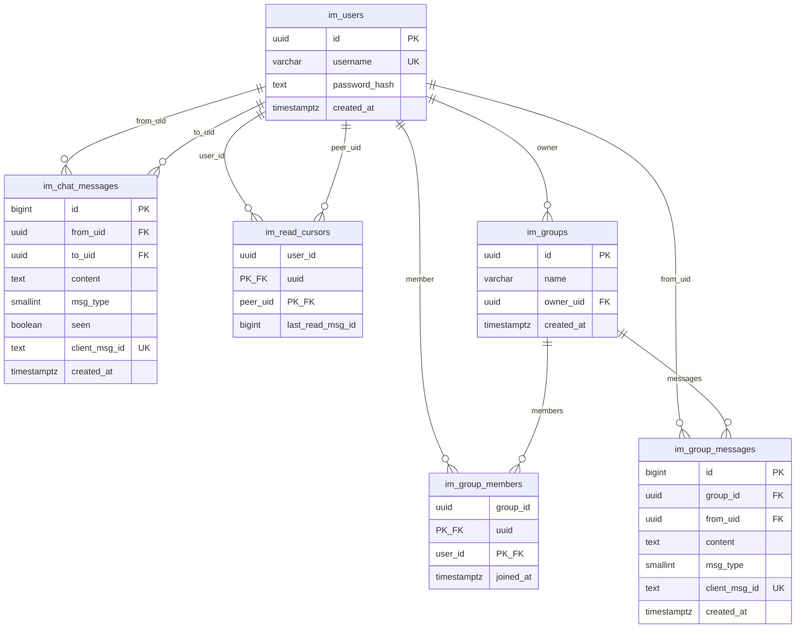

---

## Private Chat — Full Flow (v1 — `mark_delivered` WS command)

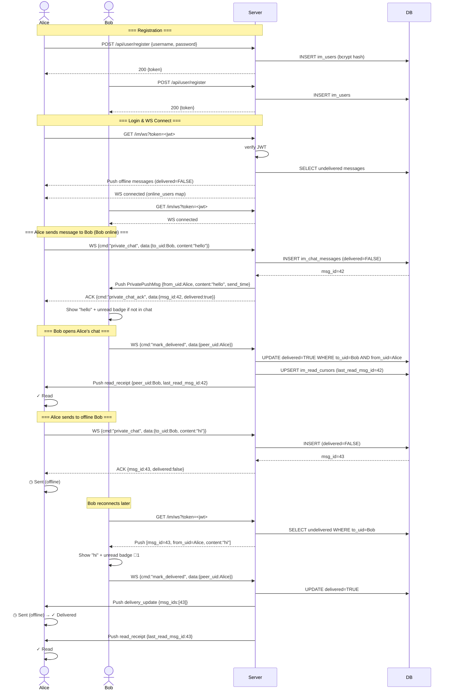

---

## Private Chat — Full Flow (v2 — seen-marking in history endpoint)

> **Change from v1:** The `mark_delivered` WS command is removed. Instead, seen-marking
> happens via `mark_seen_from_peer` (UPDATE RETURNING id) in two places:
> 1. Open chat → `GET /api/message/history` marks unseen and pushes `delivery_update`.
> 2. Receive push while viewing chat → frontend sends `mark_seen` WS command.
> Column renamed `delivered` → `seen`. Frontend states:
> ◷ Sending → ◷ Sent (online/offline both) → ✓ Read (delivery_update only).

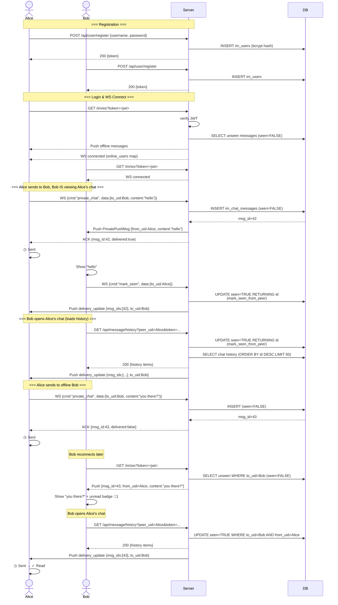

---

## Group Chat — Full Flow

> Flow covers: send → ACK → push to members → real-time `mark_group_read` →
> `group_delivery_update` with per-message read counts (sender excluded).

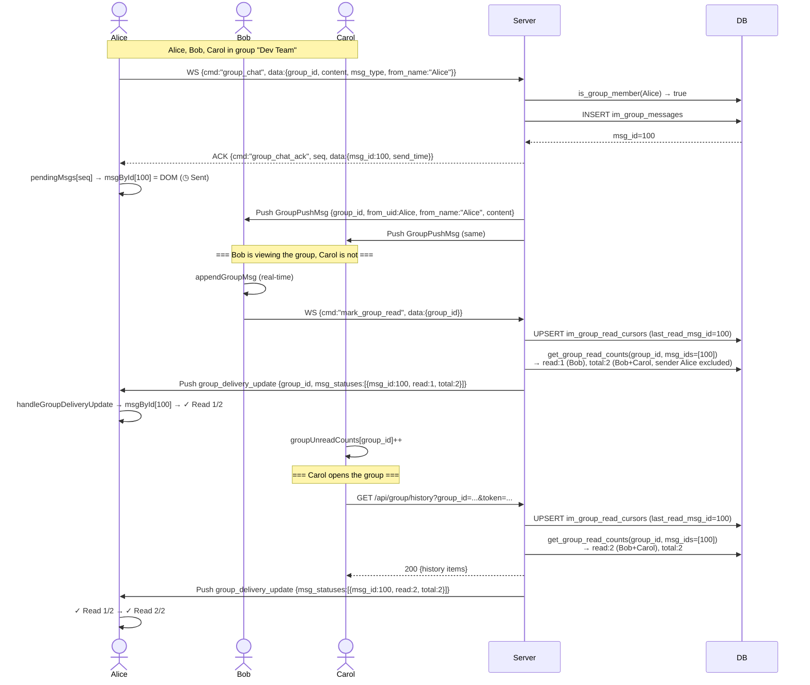

### Group Read Status State Machine

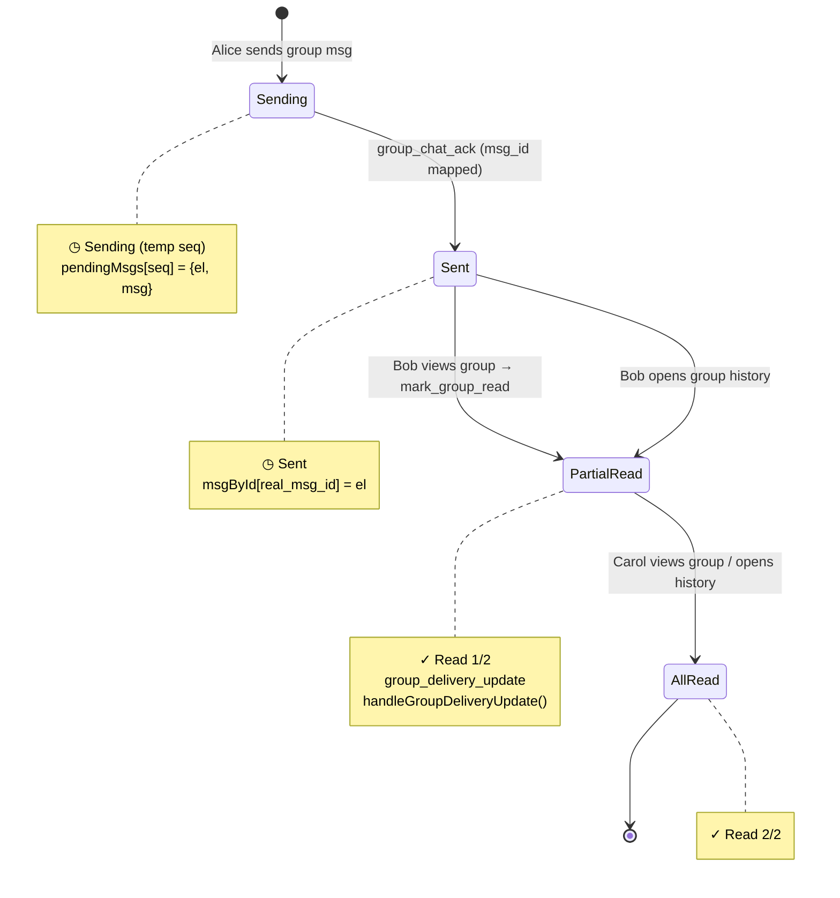

### Trigger Matrix

| Trigger                  | Initiated by                | Pushed to                     |
| ------------------------ | --------------------------- | ----------------------------- |
| `group_chat` WS          | Sender                      | Members (push) + Sender (ack) |
| `mark_group_read` WS     | Viewer receives push online | Each sender (for their msgs)  |
| `GET /api/group/history` | Viewer loads/opens group    | Each sender (for their msgs)  |

### Key Data Structures

| Structure               | Direction        | Purpose                                          |
| ----------------------- | ---------------- | ------------------------------------------------ |
| `group_chat`            | Client → Server  | Send group message (includes `from_name`)        |
| `group_push`            | Server → Members | Deliver message to online members (excl. sender) |
| `group_chat_ack`        | Server → Sender  | Return real `msg_id`, sender maps `msgById`      |
| `mark_group_read`       | Client → Server  | Viewer marks group read in real-time             |
| `group_delivery_update` | Server → Sender  | Read count changed: `{msg_id, read, total}`      |

---

## System Architecture

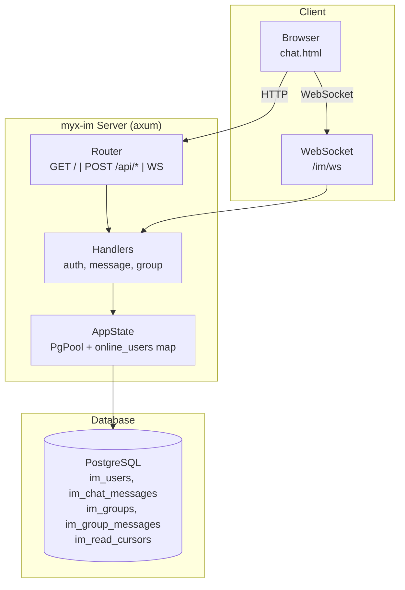

---

## Key Design Decisions

| Decision                                    | Rationale                                       |
| ------------------------------------------- | ----------------------------------------------- |
| Private & group messages in separate tables | Cleaner queries, different delivery semantics   |
| `seen` flag on messages                     | Offline sync without extra table                |
| `client_msg_id` UNIQUE                      | Dedup at DB level (ON CONFLICT DO NOTHING)      |
| Composite PK on `im_read_cursors`           | One cursor per (user, peer) pair                |
| `ON DELETE CASCADE` on group children       | Auto-cleanup when group deleted                 |
| UUID everywhere                             | No collision risk, client-side generation       |
| `include_str!("../chat.html")`              | Single binary deployment, no static file server |

---

## UI Layout — Desktop

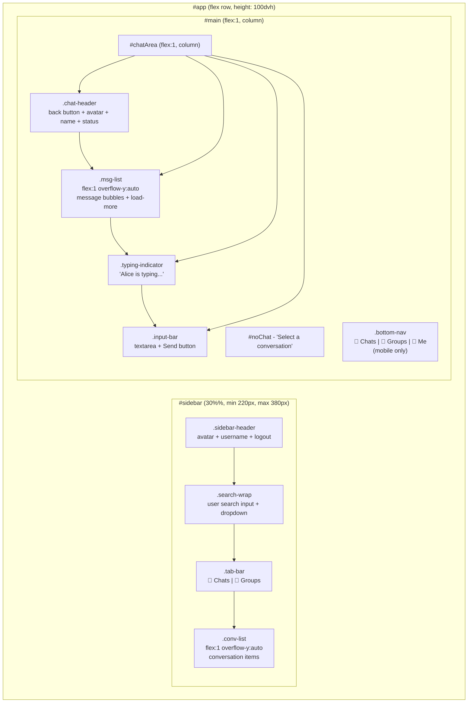

---

## UI States — View Transitions

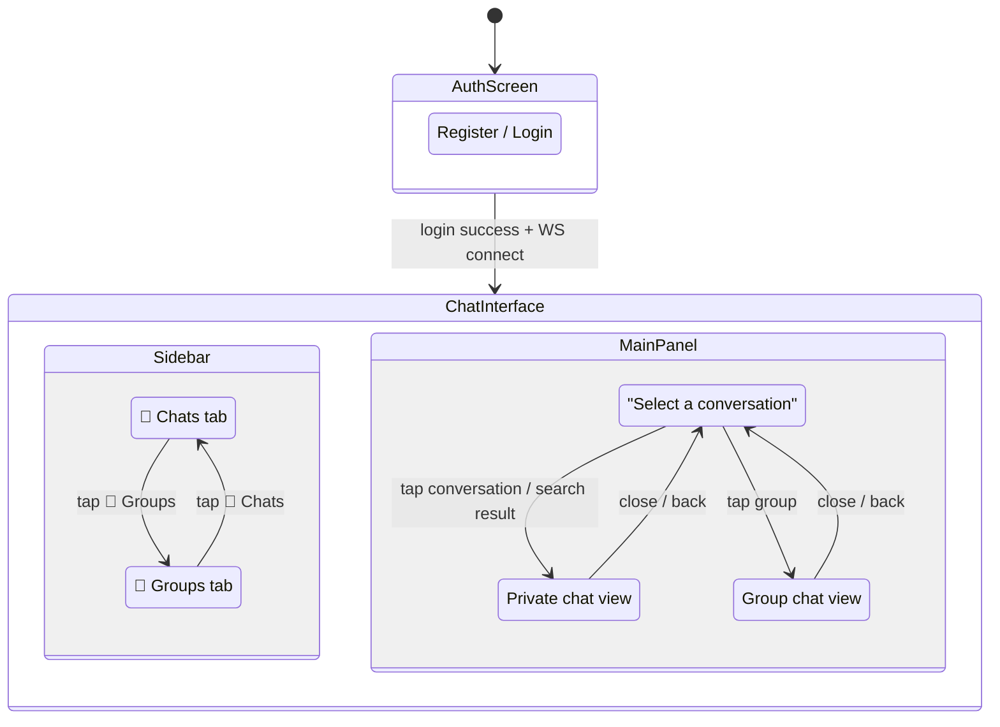

---

## UI Components — Message Row

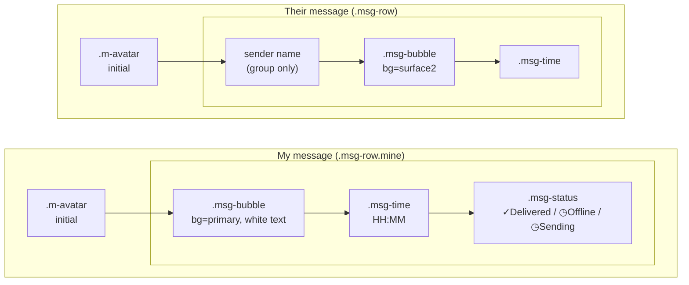

---

## JS State Machine

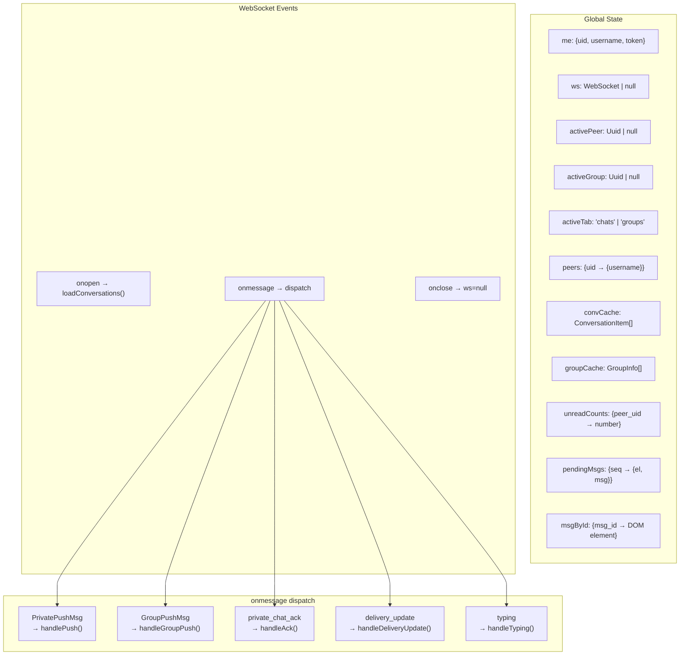

---

## Message Status State Machine

Own messages transition between three states. Status is displayed below each
message bubble and persisted to `localStorage` for survival across reloads.

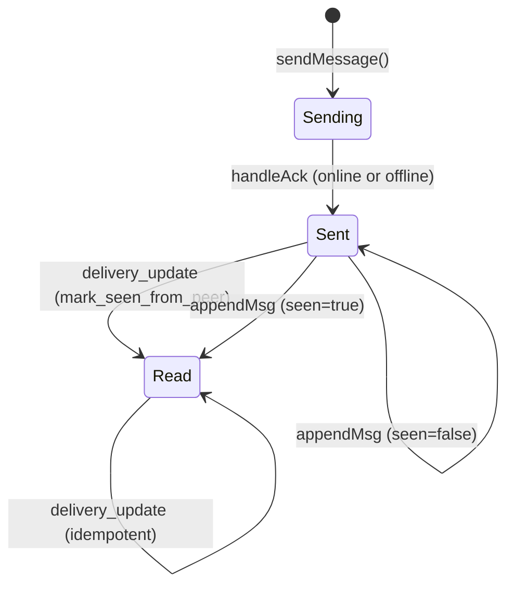

Each transition explained:

| Transition       | Function                 | Why                                                                  |
| ---------------- | ------------------------ | -------------------------------------------------------------------- |
| `Sending → Sent` | `handleAck()`            | ACK returns, clear "Sending...", set `◷ Sent` (online or offline)    |
| `Sent → Read`    | `handleDeliveryUpdate()` | Received `delivery_update` — peer opened chat or sent `mark_seen`    |
| `Read → Read`    | `handleDeliveryUpdate()` | Idempotent, repeated `delivery_update` is harmless                   |
| `Sent → Read`    | `appendMsg()`            | Loading history: `m.seen=true` (already marked in DB), show `✓ Read` |
| `Sent → Sent`    | `appendMsg()`            | Loading history: `m.seen=false`, keep `◷ Sent`                       |

| State   | Label          | CSS class      | Trigger                                 |
| ------- | -------------- | -------------- | --------------------------------------- |
| Sending | `◷ Sending...` | `.pending`     | Message sent, waiting for ACK           |
| Sent    | `◷ Sent`       | `.undelivered` | Peer offline, or history seen=false     |
| Read    | `✓ Read`       | `.delivered`   | delivery_update only (peer viewed chat) |

**Persistence**: `handleDeliveryUpdate` calls `saveMsgStatus(id, 'read')`.
On history load, `appendMsg` checks `localStorage` first, then falls back to `m.seen`.

---

## WebSocket Task Topology

How `handle_im_websocket` (src/router.rs:87) orchestrates 3 concurrent tasks
communicating via channels. Arrows show data flow.

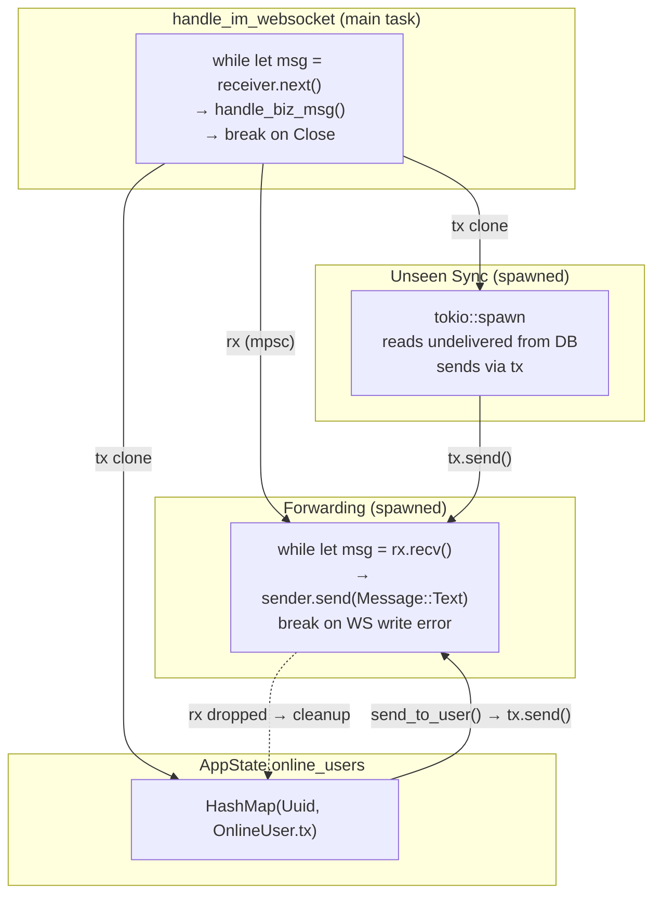

### Lifecycle

| Event                     | What happens                                                                             |
| ------------------------- | ---------------------------------------------------------------------------------------- |
| Client connects           | `insert_online_user` stores `tx` in map, spawns sync + fwd tasks                         |
| `send_to_user(uid, msg)`  | Looks up `tx` in map, sends → fwd → WS                                                   |
| Client disconnects        | WS `receiver` returns None, main exits. Fwd's `sender.send()` fails, `break`, drops `rx` |
| Kicked by duplicate login | Old fwd breaks, drops `rx`. New connection's `tx` replaces map entry                     |
| Dead entry cleanup        | Next `send_to_user` → `tx.send()` fails (rx dropped) → `mp.remove(&uid)`                 |
